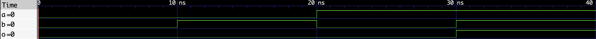

# AND Gate
## Concept
A 2-input AND Gate outputs HIGH only when both inputs are HIGH (1). 
Models CMOS transmission gate behavior at a logic level.

## Truth Table
| a | b | y |
|---|---|---|
| 0 | 0 | 0 |
| 0 | 1 | 0 |
| 1 | 0 | 0 |
| 1 | 1 | 1 |
## Waveform

- Note, swapped output `o` to `y` to better follow conventions in code.
## Files
- `and_gate.v`    | module
- `and_gate_tb.v` | testbench
- `and_gate.vcd`  | .vcd waveform