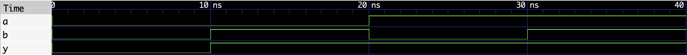

# OR Gate
## Concept
A 2-input OR Gate outputs HIGH when at least one input is HIGH. 
Models CMOS transmission gate behavior at a logic level.

## Truth Table
| a | b | y |
|---|---|---|
| 0 | 0 | 0 |
| 0 | 1 | 1 |
| 1 | 0 | 1 |
| 1 | 1 | 1 |
## Waveform

## Files
- `or_gate.v`    | module
- `or_gate_tb.v` | testbench
- `or_gate.vcd`  | .vcd waveform