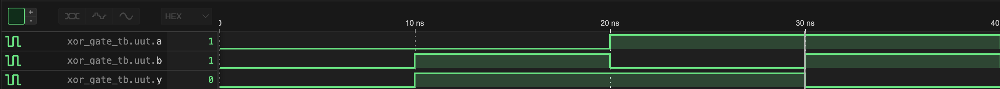

# XOR Gate
## Concept
A 2-input XOR Gate outputs HIGH when inputs differ.
Models CMOS transmission gate behavior at a logic level.

## Truth Table
| a | b | y |
|---|---|---|
| 0 | 0 | 0 |
| 0 | 1 | 1 |
| 1 | 0 | 1 |
| 1 | 1 | 0 |
## Waveform

## Files
- `xor_gate.v`    | module
- `xor_gate_tb.v` | testbench
- `xor_gate.vcd`  | .vcd waveform