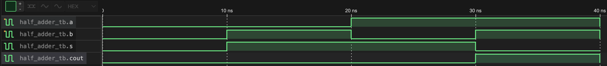

# Half Adder

## Concept
A half adder is the simplest binary addition circuit, taking two single bit inputs
and producing a sum and a carry output. It cannot account for a carry-in from a
previous stage (handled by a full adder).

The sum behaves identically to an XOR gate, and the carry behaves identically to
an AND gate.

## Truth Table
| a | b | s | cout |
|---|---|---|------|
| 0 | 0 | 0 |  0   |
| 0 | 1 | 1 |  0   |
| 1 | 0 | 1 |  0   |
| 1 | 1 | 0 |  1   |

## Implementation Note
Rather than using plain `assign` statements, this module instantiates the
`xor_gate` and `and_gate` modules built in Phase 01. This demonstrates module
composition, which is wiring together previously verified components rather than
reimplementing logic from scratch.

## Waveform

## Files
- `half_adder.v`    | module
- `half_adder_tb.v` | testbench
- `half_adder.vcd`  | .vcd waveform
- `half_adder_sim`  | compiled output